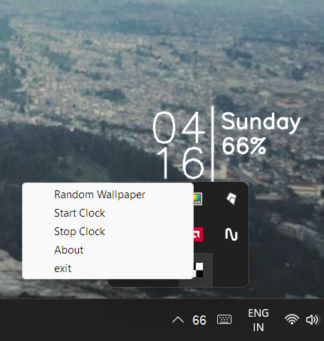

# Python Digital Clock Widget
# works best in fullhd display
<h1>Like this</h1>

<h3>Requirments</h3> 
<code>tkinter</code> 
<code>pystray</code> 
<code>pywin32</code> 
<code>requests</code> 
<code>Threading</code> 
<code>open-cv</code> 
<code>PIL</code> 

<h1>NOTE</h1>
<h2>clock refresh in every 5 second</h2>
<h2>you change position of clock and its colour from app_config.txt file</h2>
<h2>make a windows batch file then a vbs script in startup folder to auto run on startup</h2>
<h2>Refresh wallpaper is used to change wallpaper</h2>
